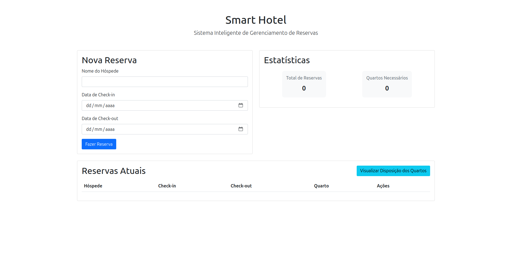
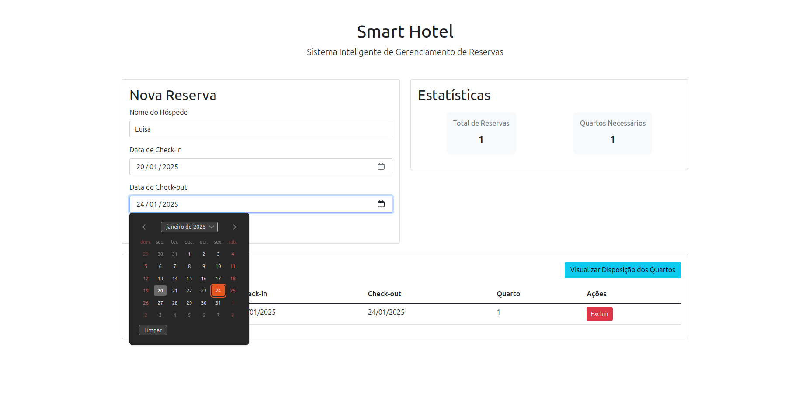
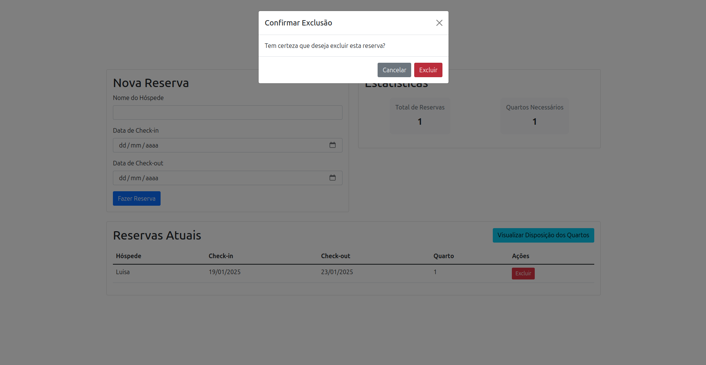
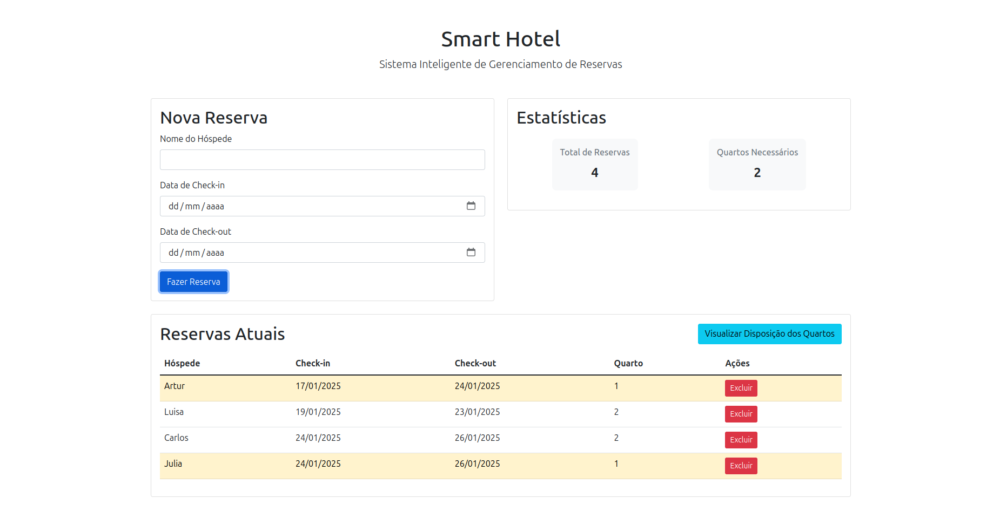
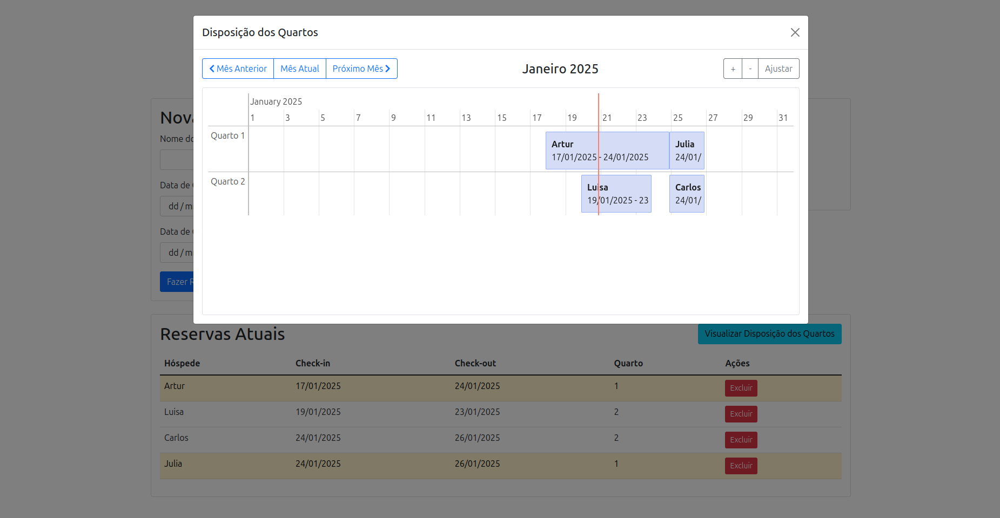

# SmartHotel

**Número da Lista**: 23 
**Conteúdo da Disciplina**: Greed 

## Alunos
|Matrícula | Aluno |
| -- | -- |
| 211030943  |  Artur Jackson Leal Fontinele |
| 211030774  |  Gustavo França Boa Sorte |

## Sobre 
SmartHotel é uma aplicação web para gerenciamento de reservas de hotel utilizando algoritmos ambiciosos (greedy) para otimização da ocupação dos quartos. A aplicação utiliza dos algoritmos de interval scheduling e interval partitioning para otimizar a distribuição das reservas nos quartos.

## Funcionalidades

### 1. Gerenciamento de Reservas
- Adicionar novas reservas com nome do hóspede, data de check-in e check-out
- Remover reservas existentes
- Visualização em lista de todas as reservas
- Alocação automática de quartos usando algoritmos greedy
- Área com estátisticas de número de reservas e quantidade de quartos necessários para atender a demanda.

### 2. Visualização da Disposição dos Quartos
- Timeline interativa mostrando todas as reservas por quarto
- Navegação por mês com controles intuitivos
- Visualização em tempo real das mudanças nas reservas
- Suporte a rolagem vertical para muitos quartos
- Zoom ajustável para melhor visualização

## Screenshots

 
*Tela inicial do sistema*

 
*Adicionando uma nova reserva*

 
*Removendo uma reserva existente*

 
*Lista de todas as reservas*

 
*Visualização de todas as reservas pela timeline*

## Instalação 

**Linguagem**: Javascript 
**Framework**: Bootstrap 

## Uso

### Gerenciando Reservas
1. Clique em "Adicionar Reserva"
2. Preencha o nome do hóspede
3. Selecione as datas de check-in e check-out
4. Clique em "Confirmar"

### Visualizando Disposição dos Quartos
1. Clique no botão "Visualizar Disposição dos Quartos"
2. Use os botões de navegação para mudar de mês
3. Use os controles de zoom (+/-) para ajustar a visualização
4. Role verticalmente se houver muitos quartos
5. Passe o mouse sobre uma reserva para ver detalhes

## Tecnologias Utilizadas
- HTML5
- CSS3
- JavaScript (ES6+)
- Bootstrap 5.1.3 (Framework CSS)
- vis-timeline 7.7.2 (Biblioteca para visualização da timeline)
- Font Awesome 5.15.3 (Ícones)

## Outros 
O projeto foi desenvolvido como parte da disciplina de Projeto de Algoritmos da Universidade de Brasília, com foco em algoritmos ambiciosos (greedy).
